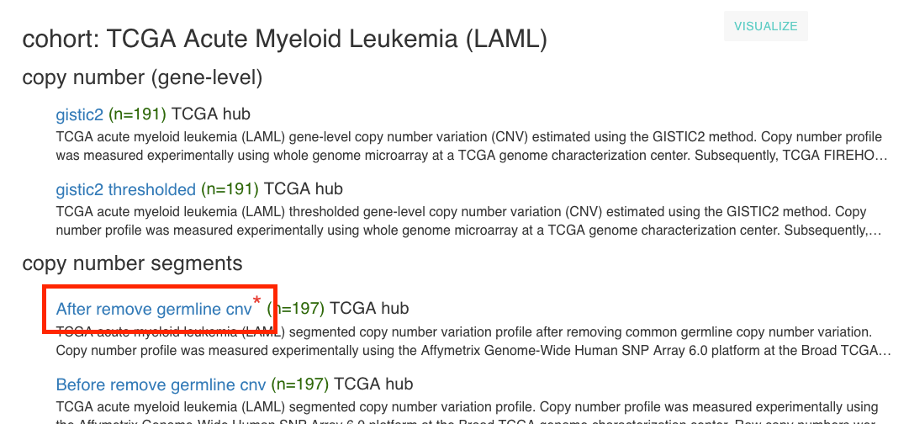
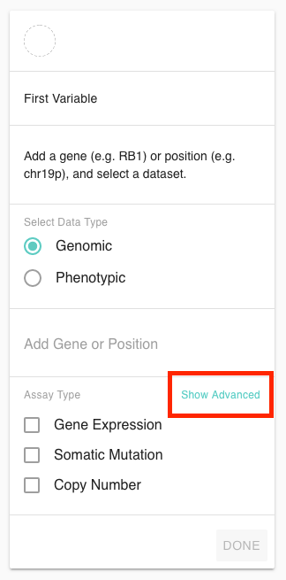

# Basic Xena Browser

## **How are the samples ordered?**

Xene Browser map view use y axis for samples, x axis/columns for genomic/phenotypic features. Data from a single sample is always displayed on the same horizontal line in the multi-column map view. Xena Browser orders samples from left to right by columns, first column, second column, etc. If there are multiple genes, identifiers, probes within in a column, samples is ordered from left to right by 1st, then 2nd gene/identifiers, and so on. 

Numerical data \(e.g. 1.2, 3.5, etc\) are ordered in descending order \(e.g. 3.5, 1.2, ...\). Categorical data \(e.g. stage, tumor type, etc\) are ordered by categories.  Positional mutation data is ordered by by genomic coordinates \(from 5'-&gt;3'\) and then by type of mutation \(mutations that destroy the transcript such as frameshift, mutations that change the transcript such as missense, silent mutations such as UTR mutations\). 

To reverse the ordering for a column, click the column menu at the top of the column and chose 'Reverse sort'

## What is the Kaplan–Meier \(KM\) plot statistics on the Xena Browser?

When there are multiple curves or lines in a KM plot, Xena Browser compares the different Kaplan–Meier curves using the log-rank test. The Browser reports the test statistics \(𝜒 2\)  and p-value \(𝜒 2 distribution\). Data is retrieved in real-time from Xena Hub\(s\) to a user's web browser and the test is performed in the browser to maintain your data privacy.

The statistics the Xena Browser reports are equivalent to R's survival package, [survdiff](https://stat.ethz.ch/R-manual/R-devel/library/survival/html/survdiff.html), with rho=0 \(default in R\). 

## **Which datasets are used in the basic wizard?**

We annotate datasets used in the basic Visual Spreadsheet wizard with a red asterisk in our datasets pages. For an example see: [https://xenabrowser.net/datapages/?cohort=TCGA%20Acute%20Myeloid%20Leukemia%20\(LAML\)](https://xenabrowser.net/datapages/?cohort=TCGA%20Acute%20Myeloid%20Leukemia%20%28LAML%29)

## How do I access other datasets than those listed in the basic menu?

Xena has many more datasets than those listed in the Basic Menu. Depending on the cohort, these can include DNA methylation, exon expression, thresholded CNV data and more. To access them, click on 'Show Advanced' below:

## How are mutations colored?

**For the somatic mutation datasets \(Somatic Mutation SNPs and small INDELs\):**

**Red** --&gt; Nonsense\_Mutation, frameshift\_variant, stop\_gained, splice\_acceptor\_variant, splice\_acceptor\_variant&intron\_variant, splice\_donor\_variant, splice\_donor\_variant&intron\_variant, Splice\_Site, Frame\_Shift\_Del, Frame\_Shift\_Ins

**Blue** --&gt; splice\_region\_variant, splice\_region\_variant&intron\_variant, missense, non\_coding\_exon\_variant, missense\_variant, Missense\_Mutation, exon\_variant, RNA, Indel, start\_lost, start\_gained, De\_novo\_Start\_OutOfFrame, Translation\_Start\_Site, De\_novo\_Start\_InFrame, stop\_lost, Nonstop\_Mutation, initiator\_codon\_variant, 5\_prime\_UTR\_premature\_start\_codon\_gain\_variant, disruptive\_inframe\_deletion, inframe\_deletion, inframe\_insertion, In\_Frame\_Del, In\_Frame\_Ins

**Green** --&gt; synonymous\_variant, 5\_prime\_UTR\_variant, 3\_prime\_UTR\_variant, 5'Flank, 3'Flank, 3'UTR, 5'UTR, Silent, stop\_retained\_variant

**Orange** --&gt; others, SV, upstream_gene_variant, downstream\_gene\_variant, intron\_variant, intergenic\_region

**For the gene-level mutation datasets \(Somatic gene-level non-silent mutation\):**

**Red \(=1\)** --&gt; indicates that a non-silent somatic mutation \(nonsense, missense, frame-shif indels, splice site mutations, stop codon readthroughs, change of start codon, inframe indels\) was identified in the protein coding region of a gene, or any mutation identified in a non-coding gene

**White \(=0\)** --&gt; indicates that none of the above mutation calls were made in this gene for the specific sample

**Pink \(=0.5\)** --&gt; some samples have two aliquots. In the event that in one aliquot a mutation was called and in the other no mutation was called, we assign a value of 0.5.

## Why can't I interact with the browser? I can see one column of data but I can't do anything?

The Visual Spreadsheet wizard asks that you add at least TWO columns of data before interacting with the browser. This is because Xena was designed to allow you to find correlations within the data and you need more than one type of data on the screen to find a trend.

## Help! My gene is showing up as gray.

In general, we recognize genes from the HUGO gene name space. If you gene name isn't recognized, try looking at Gene Card and see if other names listed there are recognized.

