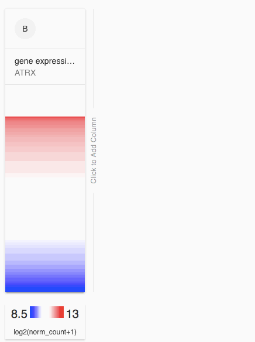

# Basic data and datasets

## What does the value of 0.5 mean for this dataset \(expression, CNV, methylation\)?

Individual values for each dataset mean different things. We recommend going to the dataset details page to learn more about the dataset. To get there, click on the column menu and choose 'About'.

You may also need to read the paper or otherwise search the internet for more information on a particular method or units \(e.g. such as GISTIC 2\).

## How can find out more about data behind a column?

We recommend going to the dataset details page to learn more about a dataset. To get there, click on the column menu and choose 'About'.

## What normalization was performed on this dataset?

We list the units and normalization at the bottom of the column. You can also go to the dataset details page to learn more about a dataset. To get there, click on the column menu and choose 'About'.

## **How do I open the download files?**

Our files are tab-delimited or '.tsv'. We recommend opening them in your favorite spreadsheet program, such as Microsoft Excel, which will automatically convert the tabs into new columns. Please note that if you have many thousands of samples, Microsoft Excel will likely have difficulty opening the file. In this case, the command line may work better for you.

