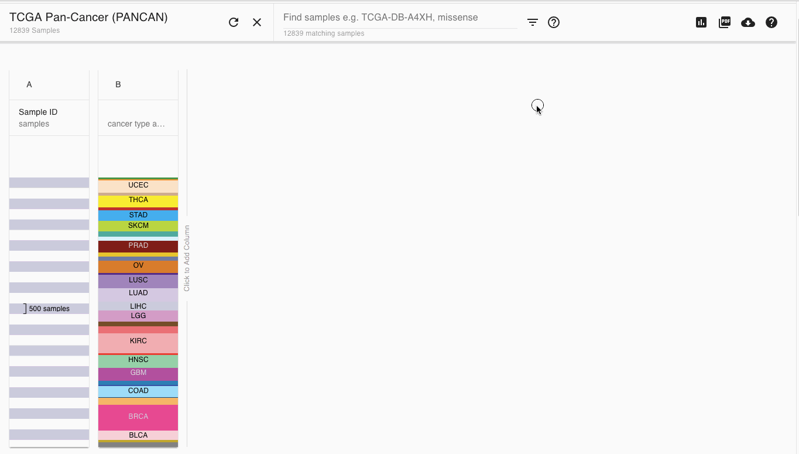

# How do I view multiple types of cancer together?

To view multiple types of cancer side-by-side, such as ovarian and breast together, you will need to start with a Pan-Cancer dataset and then filter down to just the cancer types you want to see. 

There are 2 main Pan-Cancer studies:

* [TCGA PanCan Study](https://xenabrowser.net/datapages/?cohort=TCGA%20Pan-Cancer%20%28PANCAN%29) This contains the latest data from the PanCan Atlas project, including many hand curated datasets. It also contains some legacy TCGA data across all cancer types, including GISTIC 2 CNV estimates and miRNAseq estimates.
* [GDC TCGA PanCan \(PANCAN\) Study](https://xenabrowser.net/datapages/?cohort=GDC%20Pan-Cancer%20%28PANCAN%29) This contains the latest data from the GDC across all cancer types, mapped to hg38

If you do not know which one you wish to use, we recommend starting with the TCGA PanCan Study.

## Generalized Steps

### 1. Add the phenotype column that details the cancer type

Please see the study specific instructions for which column

### 2. Use the filter functionality to select the cancer type\(s\)

Using the filter search bar:

Search for the cancer type you are interested in, making sure that it is listed in the phenotype column.


You can enter multiple cancer types separated by 'OR'. Example: 'lgg OR gbm'


More help can be found at:



### 3. Filter to just those samples

Click the Filter button next to the search bar and select 'Filter'

### 4. Add columns of data you want to see on those samples

Click on 'Click on Add column' to the right of the last column to add more data, such as gene expression, to the view.

## TCGA Pan-Cancer \(PANCAN\) Study Specific Steps/Link

For the TCGA PanCan \(PANCAN\), you will want to add the phenotype column:

> cancer type abbreviation


[Here is a bookmark ](https://xenabrowser.net/heatmap/?bookmark=d34a38000eca5f2bfcf936d5e06066dc)that will take you to the TCGA PanCan \(PANCAN\) Study with that phenotype column already selected.


## GDC TCGA PanCan \(PANCAN\) Study Specific Steps/Link

For the GDC TCGA PanCan \(PANCAN\), you will want to add the phenotype column:

> disease\_type


[Here is a bookmark ](https://xenabrowser.net/heatmap/?bookmark=647fda97e21e3626d17788770855bd3c)that will take you to the GDC TCGA PanCan \(PANCAN\) Study with that phenotype column already selected.


## Example

Below is an example for viewing breast and ovarian cancer together for the TCGA PanCan Atlas

### [Beginning of video bookmark](https://xenabrowser.net/heatmap/?bookmark=94d91442ccbf3ad7302857db86e8a3cf)

### [End of video bookmark](https://xenabrowser.net/heatmap/?bookmark=beeee48590a9183ac2944063ba4c1774)

