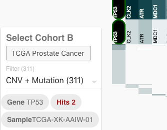
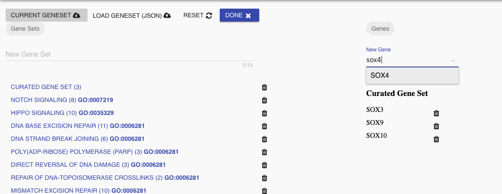
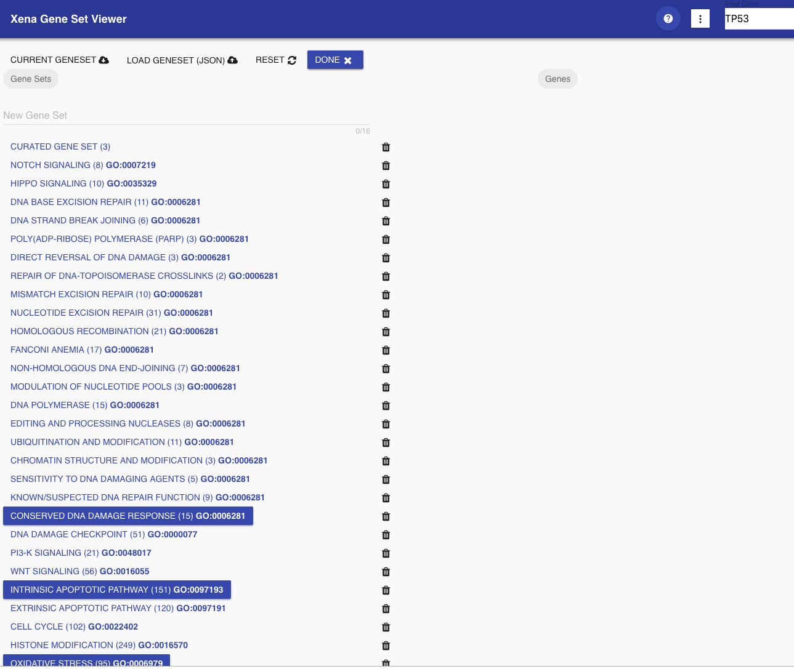

# Gene Sets Tool

The Gene Sets Tool [https://xenageneset.berkeleybop.io/xena/](https://xenageneset.berkeleybop.io/xena/) allows comparison of cancer tissue cohorts.  
It is part of the [Xena Visual Spreadsheet suite](https://xenabrowser.net/heatmap/).

Source can be found on GitHub <https://github.com/ucscXena/XenaGoWidget>.

## Overview

The Gene Set Tool allows direct comparison of individual gene sets and genes across two cancer tissue sample cohorts (Cohorts A and B).

Gene sets are list along the left-hand-side (A), with Cohort A presented on the LHS and Cohort B on the RHS. 
Darker red indicates that expression of selected events have over-represented expression and darker blue is under-represented expression of variants.
A white color indicates that the expression is average for the expected samples.

As a user hovers over gene sets the highlighted gene set is indicated in green (C), while the selected gene set (by clicking on itt) is indicated in blue. 
Genes for the selected gene set are shown in (D).  
Statistics for the hovered gene sets are shown in (B).   
Genes included in the hovered gene set are highlighted in green (D).

When hovering over genes, you either get the affected area for that gene for both cohorts 

or the score for the individual sample.

### Expanded Gene Set View

To view the compiled set of samples you can expand the gene set view by clicking on the arrows at top.

 
 
### Cohort selection

There are two primary sources for cohort data:

- https://xenabrowser.net/datapages/?hub=https://tcga.xenahubs.net:443
- https://xenabrowser.net/datapages/?cohort=Cancer%20Cell%20Line%20Encyclopedia%20(Breast)

### Filter selection

Filters are selected from the cohort box, where counts for each and the combined amount are provided for each:

### Other Options

If "Reciprocal Gene Set" is selected, then gene sets that contain any of the hovered gene set are also highlighted.

Colors and scale may be altered from the dialogs in the option.  Data may be downloaded as JSON from the current view.

Additional Gene Sets may be added or edited by selecting "Edit Pathways".

## Editing Pathways

## Gene Search

In both the Gene Set View Pathway Editing screen, genes can be searched for.  
Once highlighted, the genes and gene sets containing those genes will be highlighted in pink. 

In the Edit Pathway, there is a similar view, as well.

