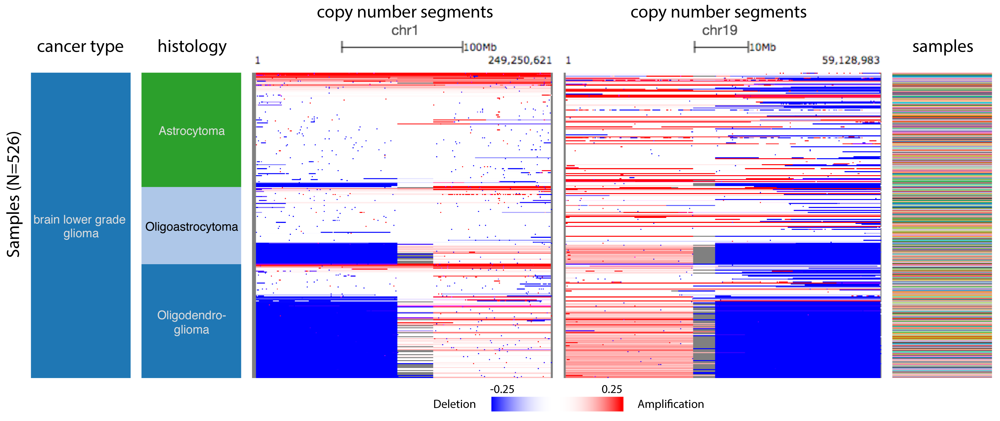
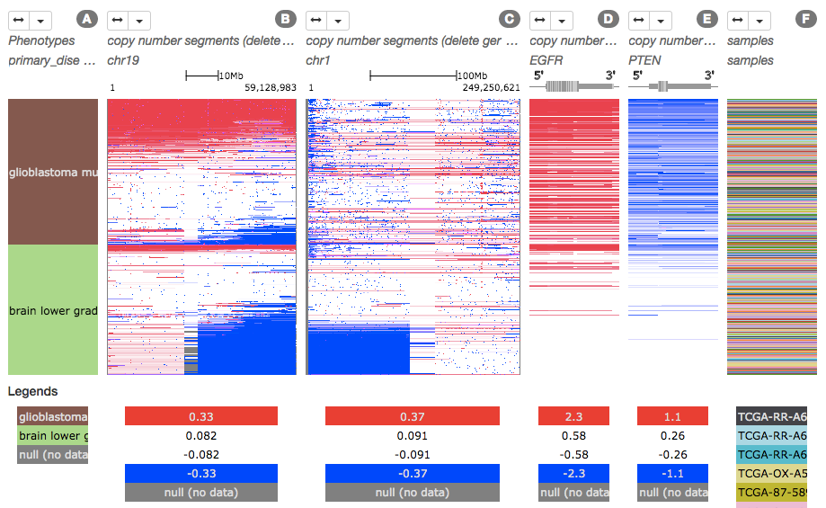
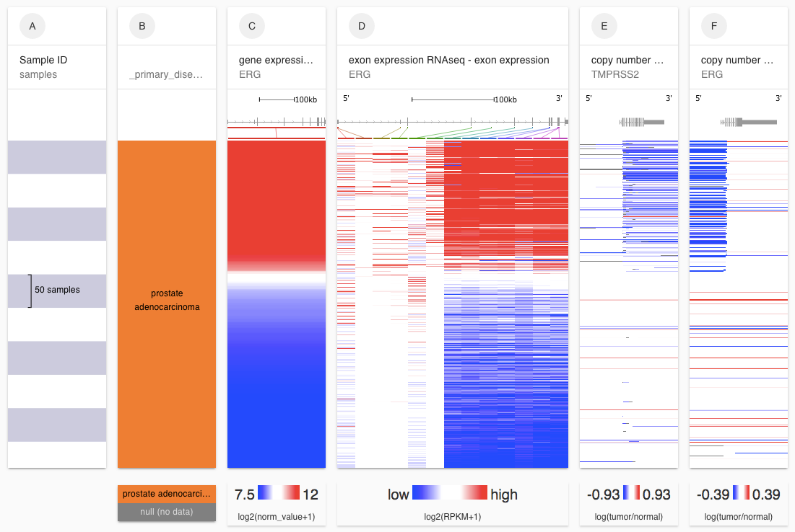
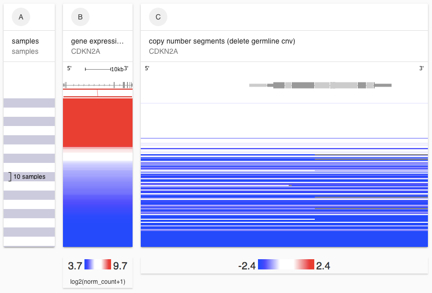
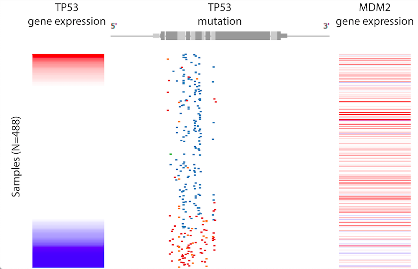
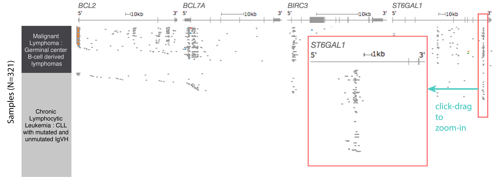

# Mutation and Copy Number Variation Columns

## Single gene display

To display a single gene, enter that gene, choose your dataset and click 'done'. To see more than one gene, add another column.When displaying a single gene, the gene model will be displayed at the top of the column. The gene model is a composite of all transcripts of the gene. Alternating light and dark shades of grey to show different exons. UTR regions are shorter in height than the CDS region. We display 2Kb upstream to show the promoter region. Use the column menu to toggle to show intronic regions.

## Chromosome range display

To display a genomic region, enter the genomic region, choose your dataset and click 'done'. We accept entire chromosomes \(e.g. chr1\), arms of chromosomes \(e.g. chr19q\), or chromosomes coordinates. Coordinates need to be in this format: chr1:100-4,000. When displaying a chromosome range, genes will be shown in dark blue at the top of the column. Hovering over a gene will display the gene name in the tooltip. Alt-click to freeze the tooltip to click on the gene name and learn more about that gene. Note that introns are always shown in this mode.

## Sorting

CNV data is sorted by the average of the entire column. 

Mutation data is sorted by the genomic position of the mutation. For both the CNV and mutation data, you can choose to instead sort by the region you are zoomed to through the column menu.

## Coloring

CNV is colored red to blue for amplification to deletion. 

Mutation data is colored by the functional impact:

* Red - Deleterious
* Blue - Missense
* Orange - Splice site mutation
* Green - Silent
* Gray - Unknown

[More detailed information](../../faq/basic-xena-browser.md#how-are-mutations-colored)

## CNV Examples

### Co-deletions in Lower Grade Glioma 

[Live bookmark of above image](https://xenabrowser.net/heatmap/?bookmark=fdb3fa1573bc4f293281c6059e7ca702)

For each of the three subtypes of TCGA Lower Grade Glioma, you can see corresponding deletions in chromosome 1p \(3rd column from the left\) and chromosome 19q \(4th column\).

### Deletions and Amplifications in Gliomas 

[Live bookmark of above image](https://xenabrowser.net/?bookmark=3001c94bea71d6b0aa9de085ef02f637)

Looking more broadly at Glioblastoma Multiforme \(GBM\) and Lower Grade Glioma \(LGG\) in TCGA \(column A\), we can see the same arm-level co-deletions in chr1p \(column B\) and chr19q \(column C\) primarily in LGG tumors. Columns D and E show us an amplification in EGFR and a deletion in PTEN, both of which are associated with GBM rather than LGG tumors.

### TMPRSS2-ERG Fusion in TCGA Prostate Cancer 

[Live bookmark of above image](https://xenabrowser.net/?bookmark=2b2360ede42b216a0c26f9497f44fc4f)

We can use the segmented CNV data to more closely examine the well-known TMPRSS2-ERG fusion in Prostate Cancer, where the oncogene ERG fuses to the TMPRSS2 promoter, driving over-expression of ERG \(St. John 2012, Adamo 2016\). We can see in columns D and E the specific break point in each gene and their relationship to over expression in ERG \(column A\). Looking more closely at which exons are over expressed, we can see that it is primarily in the 3' exons.

### CDKN2A deletion in TCGA Glioblastoma 

[Live bookmark of above image](https://xenabrowser.net/heatmap/?bookmark=eb986c8444a858756a047fb8311a930f)

Using the segmented CNV dataset we can see the relationship between CDKN2A deletion and lowered CDKN2A expression in TCGA Glioblastoma.

## Mutation Examples

### Mutation and Expression data side-by-side

[Live bookmark to above view](https://xenabrowser.net/heatmap/?bookmark=3bb71b72f169530783d24a40dcdaeff4)

View mutations side-by-side with other data, such as gene expression. As shown above in TCGA Lung Adenocarcinoma \(LUAD\), lower TP53 expression correlates with nonsense, frame-shift mutations; and higher expression is associated with missense mutations.

### Intronic Mutations in ICGC Lymphoma Cohorts

[Live bookmark of above image](https://xenabrowser.net/heatmap/?bookmark=27d8bc5b7904f768374a1eeae9baed81)

Xena mutation views supports examination of both coding and non-coding mutations from whole genome analysis. We support viewing mutations from both gene- or coordinate- centric perspective. In the gene-centric view, you can dynamically toggle to show or hide introns from the view. This figure shows the frequent intron mutations in 321 samples from the ICGC lymphoma cohorts. These 'pile-ups' would be not be visible if viewing mutations only in the exome. These intron mutations overlap with known enhancers regions \(Mathelier 2015\).

Mathelier A, Lefebvre C, Zhang AW, Arenillas DJ, Ding J, Wasserman WW, Shah SP. Cis-regulatory somatic mutations and gene-expression alteration in B-cell lymphomas Genome Biology. 2015; 16:84.

